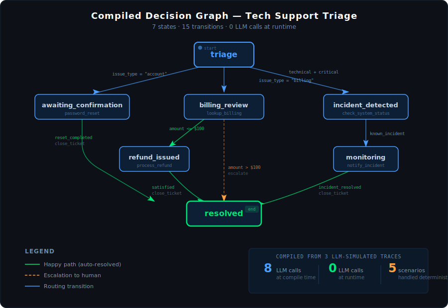

<div align="center">


<br/>

# Decision Structure Compiler

### Compile AI Reasoning Into Deterministic Logic

*Use the LLM once at design time. Run deterministic decisions forever — zero API calls, zero latency, zero hallucinations.*

[](https://www.python.org/downloads/)
[](#testing)
[](LICENSE)

---

</div>

## The Problem

Every AI-powered workflow today calls an LLM on **every single execution**. Every customer support ticket, every content moderation decision, every approval routing — each one burns tokens, adds latency, and introduces unpredictability.

But here's the insight: in most business domains, **the same types of inputs lead to the same types of decisions**. The decision logic is finite and stable. You don't need a genius to answer the same question for the 10,000th time — you need a state machine.

## The Solution

DSC flips the model: **the LLM thinks once, the state machine runs forever.**

```
┌─────────────────────────────────┐        ┌──────────────────────────────┐
│        COMPILE TIME             │        │          RUNTIME             │
│        (LLM-powered)            │        │        (Zero LLM)            │
│                                 │        │                              │
│  Scenarios + Test Inputs        │        │   Compiled        Live       │
│         │                       │        │   Artifact ◄── Observation   │
│         ▼                       │        │      │                       │
│   LLM Simulates Traces         │        │      ▼                       │
│         │                       │        │   Evaluate Conditions        │
│         ▼                       │        │      │                       │
│   Extract Decision Graph        │ ─────► │      ▼                       │
│         │                       │  .json │   Match Transition           │
│         ▼                       │        │      │                       │
│   Optimize + Compile            │        │      ▼                       │
│                                 │        │   Execute Action             │
└─────────────────────────────────┘        └──────────────────────────────┘
     Pay once                                   Run free forever
```

<div align="center">

| | LLM at Runtime | DSC (Compiled) |
|:---|:---:|:---:|
| **Cost per decision** | ~$0.01–0.10 | **$0** |
| **Latency** | 500ms–5s | **<1ms** |
| **Deterministic** | No | **Yes** |
| **Auditable** | Hard | **Fully** |
| **Works offline** | No | **Yes** |

</div>

## Quick Start

```bash
pip install -e ".[dev]"
```

### 60-Second Demo

```bash
# Run the full pipeline example (no API key needed — uses mocked LLM)
python examples/full_pipeline/demo.py
```

This walks through the entire workflow: define a scenario → LLM simulates traces → extract decision graph → optimize → compile → run deterministically. **8 LLM calls at compile time → 7-state, 15-transition graph that handles 5 runtime scenarios with zero AI.**

Here's the decision graph that gets compiled from 3 LLM-simulated traces:

<div align="center">

</div>

### CLI Workflow

```bash
dsc init "My Project"                                          # 1. Create project
dsc scenario create <project-id> "Support Bot" \               # 2. Define scenario
    --context "Handle customer support"
dsc trace simulate <project-id> <scenario-id> input.json       # 3. Simulate traces
dsc extract <project-id> <scenario-id>                         # 4. Extract graph
dsc optimize <project-id> <scenario-id>                        # 5. Optimize
dsc compile <project-id> <scenario-id>                         # 6. Compile artifact
dsc run .dsc_data/.../compiled/v1.json                         # 7. Run forever
```

### Python API

```python
from dsc.compiler.compiler import CompiledArtifact
from dsc.runtime.engine import RuntimeEngine

# Load and run — no LLM, no API keys, no network
artifact = CompiledArtifact.from_json(open("compiled/v1.json").read())
engine = RuntimeEngine.from_artifact(artifact)
engine.start()

result = engine.step({"intent": "refund", "order_age_days": 5, "amount": 45.00})
# result.action = "approve_refund"
# result.to_state = "refund_approved"
# Deterministic. Every time. Forever.
```

## How It Works

### Phase 1: Compile Time (LLM-Powered)

**Define** a scenario with context, observation schema, actions, tools, and constraints. **Simulate** traces by feeding test inputs to the LLM. **Extract** a decision graph through a 3-phase pipeline:

| Phase | What happens | Example |
|:---|:---|:---|
| **A. Extract** | Pull raw transitions from each trace | `triage → billing_review` when issue is billing |
| **B. Normalize** | Deduplicate states across traces | `"intake"` and `"initial_assessment"` → `"triage"` |
| **C. Formalize** | Convert reasoning to structured conditions | `"amount under $100"` → `refund_amount lte 100` |

**Optimize** the graph (prune unreachable states, merge duplicates, detect conflicts). **Compile** into a versioned, self-contained JSON artifact.

### Phase 2: Runtime (Zero LLM)

Load the artifact. Evaluate structured conditions against live observations. Execute transitions deterministically. **No API calls. No tokens. No network. No surprises.**

The formal model at the core:

```
(Current State + Condition) → (Action, Next State)
```

Conditions aren't strings or prompts — they're a structured AST (`FieldCondition`, `ConditionGroup`, `AlwaysTrue`) that evaluates to boolean with zero ambiguity. 10 operators, arbitrary nesting, dot-path field access.

## Examples

Four runnable examples — no API key needed:

| Example | What it shows | Run it |
|:---|:---|:---|
| **[Full Pipeline](examples/full_pipeline/)** | Complete workflow: scenario → LLM → graph → runtime | `python examples/full_pipeline/demo.py` |
| **[Customer Support](examples/customer_support/)** | Intent routing, VIP overrides, compound conditions | `python examples/customer_support/demo.py` |
| **[Content Moderation](examples/content_moderation/)** | Multi-stage filtering with threshold-based routing | `python examples/content_moderation/demo.py` |
| **[Programmatic API](examples/programmatic_api/)** | Build everything from code, no CLI or LLM | `python examples/programmatic_api/build_and_run.py` |

## When To Use DSC

**Good fit:** Customer support routing, content moderation, approval workflows, order processing — any domain where the same types of inputs lead to the same types of decisions.

**Not a fit:** Open-ended creative tasks, truly unbounded state spaces, one-off tasks.

**The litmus test:** *"If I saw 50 examples of this task, would I start seeing patterns?"* If yes, DSC can compile those patterns.

## Architecture

```
src/dsc/
  models/             Pydantic data models (conditions, scenarios, traces, graphs)
  storage/            JSON filesystem persistence
  scenario_manager/   CRUD + lifecycle enforcement
  trace_collector/    Trace validation + LLM simulation
  graph_extractor/    3-phase LLM extraction pipeline
  graph_optimizer/    Pruning, merging, conflict detection
  compiler/           Graph → versioned JSON artifact
  runtime/            Deterministic execution engine
  llm/                Anthropic Claude client + prompts
  cli/                Typer CLI
```

## Testing

```bash
pytest              # 125+ tests
pytest -v           # verbose
```

## Design Principles

| Principle | Over |
|:---|:---|
| Explicit State | Implicit Reasoning |
| Determinism | Probabilistic Execution |
| Structure Extraction | Model Distillation |
| Compilation | Repeated Inference |
| Scenario Isolation | Global Agent |

**This is not an agent framework.** It's a compiler. LLMs think once. State machines run forever.

## License

MIT
