<div align="center">


<br/>

# Decision Structure Compiler

### Compile AI Reasoning Into Deterministic Logic

*Use the LLM once at design time. Run deterministic decisions forever — zero API calls, zero latency, zero hallucinations.*

[](https://www.python.org/downloads/)
[](#testing)
[](LICENSE)
[](https://docs.anthropic.com/)
[](#how-it-works)

---

| | LLM at Runtime | DSC (Compiled) |
|:---|:---:|:---:|
| **Cost per decision** | ~$0.01–0.10 | **$0** |
| **Latency** | 500ms–5s | **<1ms** |
| **Deterministic** | No | **Yes** |
| **Auditable** | Hard | **Fully** |
| **Works offline** | No | **Yes** |

</div>

## Why?

Every AI workflow today calls an LLM on **every single execution**. But in most business domains — support routing, content moderation, approvals — the decision logic is **finite and stable**. You don't need a genius to answer the same question for the 10,000th time. You need a state machine.

DSC flips the model: **the LLM thinks once, the state machine runs forever.**

## Install

**Python package:**

```bash
pip install -e ".[dev]"
```

**Standalone executable** (distribute to machines without Python):

```bash
# Build (requires Python + PyInstaller)
pip install -e ".[build]"
python scripts/build.py          # outputs dist/dsc (or dist/dsc.exe)

# Run anywhere — no Python needed
./dist/dsc --help
```

Or download a pre-built binary from [Releases](https://github.com/ybj91/decision-structure-compiler/releases).

## Demo

```bash
python examples/full_pipeline/demo.py    # no API key needed
```

**8 LLM calls at compile time → 7-state graph → 5 runtime scenarios with zero AI:**

<div align="center">

</div>

The compiled decision graph:

<div align="center">

</div>

## How It Works

```
 COMPILE TIME (LLM)                    RUNTIME (Zero LLM)
 ┌───────────────────────┐             ┌────────────────────────┐
 │ Scenario + Test Inputs│             │ Compiled    Live Input │
 │        │              │             │ Artifact ◄── Observation│
 │        ▼              │   .json     │    │                   │
 │  LLM Simulates Traces │ ─────────►  │    ▼                   │
 │        │              │             │ Evaluate → Transition  │
 │        ▼              │             │    │                   │
 │  Extract + Optimize   │             │    ▼                   │
 │        │              │             │ Execute Action         │
 │        ▼              │             │                        │
 │  Compile Artifact     │             │ Deterministic. Always. │
 └───────────────────────┘             └────────────────────────┘
      Pay once                              Run free forever
```

The formal model: **`(State + Condition) → (Action, Next State)`**

> Conditions aren't strings or prompts — they're a structured AST that evaluates to boolean with zero ambiguity.

## Quick Start

```python
from dsc.compiler.compiler import CompiledArtifact
from dsc.runtime.engine import RuntimeEngine

# Load and run — no LLM, no API keys, no network
artifact = CompiledArtifact.from_json(open("compiled/v1.json").read())
engine = RuntimeEngine.from_artifact(artifact)
engine.start()

result = engine.step({"intent": "refund", "order_age_days": 5, "amount": 45.00})
# result.action = "approve_refund"
# result.to_state = "refund_approved"
# Deterministic. Every time. Forever.
```

<details>
<summary><b>CLI Workflow</b></summary>

```bash
dsc init "My Project"                                          # 1. Create project
dsc scenario create <project-id> "Support Bot" \               # 2. Define scenario
    --context "Handle customer support"
dsc trace simulate <project-id> <scenario-id> input.json       # 3. Simulate traces
dsc extract <project-id> <scenario-id>                         # 4. Extract graph
dsc optimize <project-id> <scenario-id>                        # 5. Optimize
dsc compile <project-id> <scenario-id>                         # 6. Compile artifact
dsc run .dsc_data/.../compiled/v1.json                         # 7. Run forever
```

</details>

## Examples

Four runnable examples — no API key needed:

| Example | What it shows |
|:---|:---|
| **[Full Pipeline](examples/full_pipeline/)** | Complete workflow: scenario → LLM → graph → runtime |
| **[Customer Support](examples/customer_support/)** | Intent routing, VIP overrides, compound conditions |
| **[Content Moderation](examples/content_moderation/)** | Multi-stage filtering with threshold-based routing |
| **[Programmatic API](examples/programmatic_api/)** | Build everything from code, no CLI or LLM |

## Already Have an Agent? Analyze It First

Not sure if your agent can be compiled? **Run the analyzer** — it parses your agent's source code and/or execution logs, tells you what's compilable, and generates ready-to-use DSC scenarios:

```bash
# Analyze source code
dsc analyze code ./my_agent/ --output report.json

# Analyze execution logs
dsc analyze logs ./logs/ --output report.json

# Both at once (merged analysis, higher confidence)
dsc analyze code ./my_agent/ --logs ./logs/ --output report.json

# Create DSC scenarios from the report
dsc analyze apply report.json my-project-id
```

The report includes a compilability score, identified decision patterns, suggested scenarios, and a **cost savings estimate** (breakeven point, savings per 1K executions).

## Claude Code Skills

If you use [Claude Code](https://claude.ai/code), DSC ships with three slash commands:

| Skill | What it does |
|:---|:---|
| `/dsc-analyze` | Analyze the current codebase for compilable patterns — score, decision points, cost savings |
| `/dsc-compile` | Full pipeline: init project → apply scenarios → simulate → extract → optimize → compile |
| `/dsc-run` | Load a compiled artifact, run test inputs, show deterministic execution |

```
> /dsc-analyze ./my_agent/
> /dsc-compile
> /dsc-run
```

## When To Use DSC

*"If I saw 50 examples of this task, would I start seeing patterns?"* — If yes, DSC can compile those patterns.

**Good fit:** Customer support routing, content moderation, approval workflows, order processing.
**Not a fit:** Open-ended creative tasks, unbounded state spaces, one-off tasks.

<details>
<summary><b>Architecture</b></summary>

```
src/dsc/
  analyzer/           Compilability analysis (code + logs → report → scenarios)
  models/             Pydantic data models (conditions, scenarios, traces, graphs)
  storage/            JSON filesystem persistence
  scenario_manager/   CRUD + lifecycle enforcement
  trace_collector/    Trace validation + LLM simulation
  graph_extractor/    3-phase LLM extraction pipeline
  graph_optimizer/    Pruning, merging, conflict detection
  compiler/           Graph → versioned JSON artifact
  runtime/            Deterministic execution engine
  llm/                Anthropic Claude client + prompts
  cli/                Typer CLI
```

</details>

<details>
<summary><b>Design Principles</b></summary>

| Principle | Over |
|:---|:---|
| Explicit State | Implicit Reasoning |
| Determinism | Probabilistic Execution |
| Structure Extraction | Model Distillation |
| Compilation | Repeated Inference |
| Scenario Isolation | Global Agent |

</details>

## Testing

```bash
pytest    # 158 tests
```

## License

MIT

---

<div align="center">

**This is not an agent framework.** It's a compiler. LLMs think once. State machines run forever.

</div>
